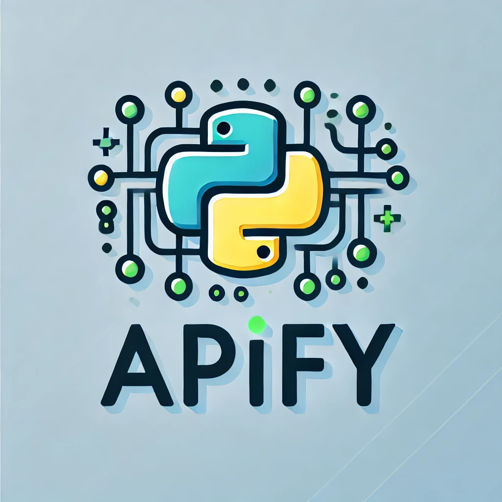

# Apify a Python API Endpoint Generator





### Developed by: ERICO NETTO  
**First Version:** 20-Sep-2024  

## Overview

This script automatically generates RESTful API endpoints for Python functions in modules located in a specified folder. It traverses through all subfolders, generating endpoints for each function found, while allowing specific directories to be ignored.

## How It Works

1. **Folder Scanning**  
   - The script scans the **root folder** (default: current directory) and its subfolders for Python files.
   - It ignores folders specified in the `ignore` list (`["venv", "__pycache__"]` by default).

2. **Endpoint Generation**  
   - For each Python module found, an API endpoint is generated for each function within that module.
   - Endpoint paths follow this structure:  
     ```
     <server_url>/folder1/folder2/module_name/function_name
     ```
   - Example:  
     ```
     http://localhost:5000/folder1/folder2/sample_module/sample_function
     ```

3. **Endpoint Documentation**  
   - Documentation for all endpoints can be accessed by performing a `GET` request at the root URL:  
     ```
     <server_url>/
     ```

## Endpoint Behavior

- **GET and POST Methods**:  
  If the function does not accept parameters, both `GET` and `POST` will return the function's output.  

  - Return Format:  
    ```json
    {"data": <data returned by the function>}
    ```
  - If the function returns nothing:
    ```json
    {"data": null}
    ```

- **Passing Parameters**:  
  - Parameters must be passed in JSON format via `POST`.
  - Example:  
    ```python
    # Python function
    def sum(a, b):
        return a + b
    ```
    - POST request body:  
      ```json
      {"a": 1, "b": 2}
      ```

## Special Internal Parameters

Three internal parameters are automatically passed if the function has them defined:

- **`apify_app`**:  
  The `Flask` app object of the module (`apify_app = Flask(__name__)`).  
  Example:
  ```python
  def example_to_redirect(apify_app):
      redirect_url = "https://url.to.redirect.com/path"
      return apify_app.redirect(redirect_url)

- `apify_request`:
The request object when the Flask endpoint function is called.
Example:

    ```python
    def example_to_get_query_string(apify_request):
        query_string = apify_request.query_string
        return f'Query string: {query_string}'
    ```

- `apify_modules_args`:
Arguments from environment variables (MODULES_ARGS).
Example:

    ```python
    # Pass an environment variable value to 'apify_modules_args'
    def example_get_a_external_custom_variable(apify_modules_args):
        return f'My external custom variable is: {apify_modules_args}'
    ```

## Environment Variables

You can configure the script using the following environment variables:

- `PYTHON_MODULES_FOLDER`:

Specifies the root folder containing Python module files. Default is the current directory.

- `IGNORE`:

A comma-separated list of folders to ignore during traversal. Example: `"venv,__pycache__"`

- `MODULES_ARGS`:

Value passed to any function with `apify_modules_args` as an argument, useful for custom configurations.

## Example Usage

```python
# Example function using 'apify_app' to redirect
def example_to_redirect(apify_app):
    redirect_url = "https://url.to.redirect.com/path"
    return apify_app.redirect(redirect_url)

# Example function using 'apify_request' to access query string
def example_to_get_query_string(apify_request):
    query_string = apify_request.query_string
    return f'Query string: {query_string}'

# Example function using 'apify_modules_args' for custom environment variable
def example_get_a_external_custom_variable(apify_modules_args):
    return f'My external custom variable is: {apify_modules_args}'
```

### Getting Started
1. Set up the environment variables as needed.
2. Run the script.
3. Access your endpoints via <server_url>/<folder_path>/<module_name>/<function_name>.

### Docker
```
docker build --no-cache -t python-app .
docker run -e EXPOSE_PORT=8080 -p 8080:8080 python-app
```

## License

This project is licensed under the GNU General Public License v3.0 (GPL-3.0).

- You must provide a copy of this license with any distribution of this software.
- Any modifications must retain the original developer's name: ERICO NETTO.
- Derived works must also be open-source under the same license and a copy of the original license

For more details, please refer to the [full text of the GPL-3.0 License](https://www.gnu.org/licenses/gpl-3.0.txt).

